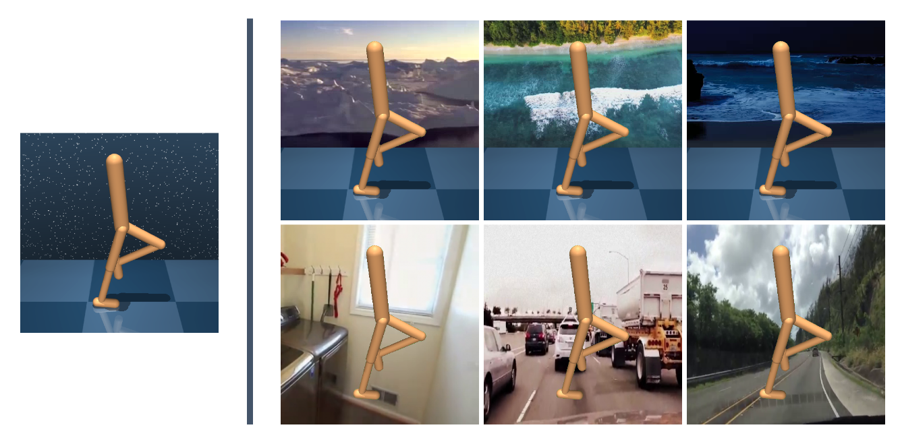

# Dream to Generalize (Dr. G): Zero-Shot Model-Based Reinforcement Learning for Unseen Visual Distractions
This repository contains the environments in our paper:

[Dream to Generalize: Zero-Shot Model-Based Reinforcement Learning for Unseen Visual Distractions](https://github.com/JeongsooHa/DrG) <br>
(Paper has not yet been published.)

> [AAAI 2023](https://aaai-23.aaai.org/)  <br>
>Jeongsoo Ha*, Kyungsoo Kim, Yusung Kim

# Abstract
<br>
Figure 1: The agent is trained in a simple background envi- ronment on the DeepMind Control suite in the default setting (left). We demonstrate the generalization ability in unseen environments in video easy settings (a top row on the right) and video hard settings (a bottom row on the right).
<br>
***
Model-based reinforcement learning (MBRL) has been used to efficiently solve vision-based control tasks in high- dimensional image observations. Although recent MBRL algorithms perform well in trained observations, they fail when faced with visual distractions in observations. These task-irrelevant distractions (e.g., clouds, shadows, and light) may be constantly present in real-world scenarios. In this study, we propose a novel self-supervised method, Dream to Generalize (**Dr. G**), for zero-shot MBRL. **Dr. G** trains its en- coder and world model with dual contrastive learning which efficiently captures task-relevant features among multi-view data augmentations. We also introduce a recurrent state in- verse dynamics model that helps the world model to bet- ter understand the temporal structure. The proposed methods can enhance the robustness of the world model against visual distractions. To evaluate the generalization performance, we first train **Dr. G** on simple backgrounds and then test it on complex natural video backgrounds in the DeepMind Con- trol suite, and the randomizing environments in Robosuite. **Dr. G** yields a performance improvement of **117%** and **14%** over prior works, respectively.

# Installation
We assume that you have access to a GPU with CUDA >=11.0 support. 
All dependencies can then be installed with the following commands:

```
conda env create -f setup/conda.yml
conda activate drg
sh setup/install_envs.sh
```

# Instructions
To train a DrG agent on the walker walk task.
```
python src/train.py --algorithm drg --eval_mode video_hard --seed 1
```